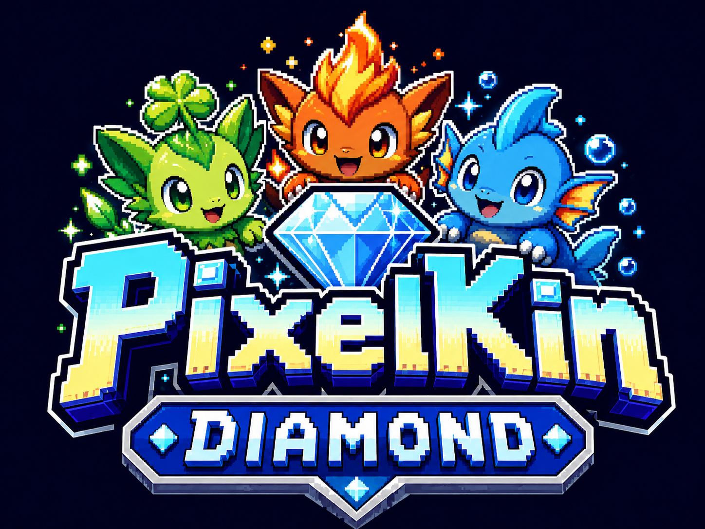
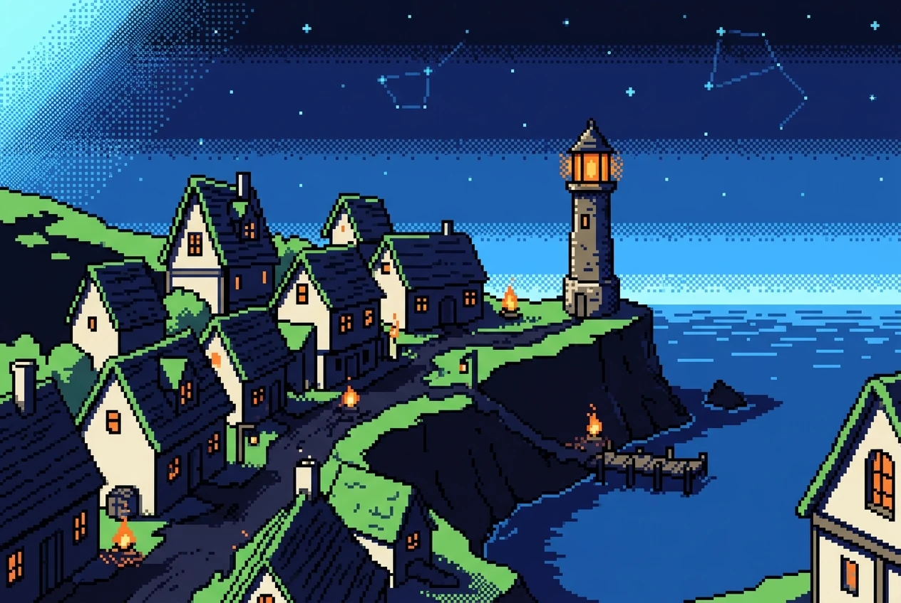
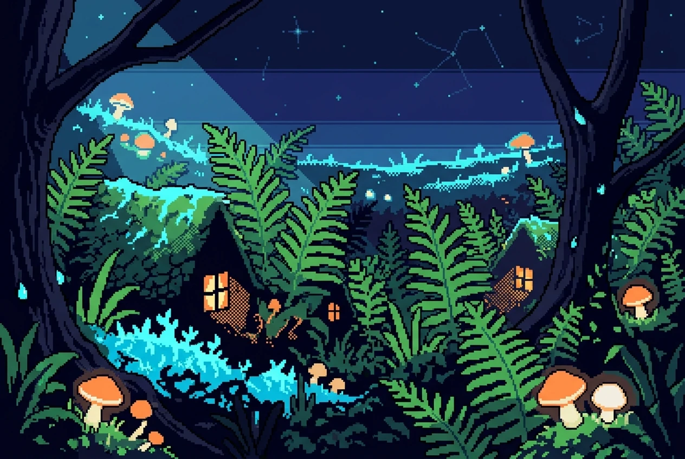
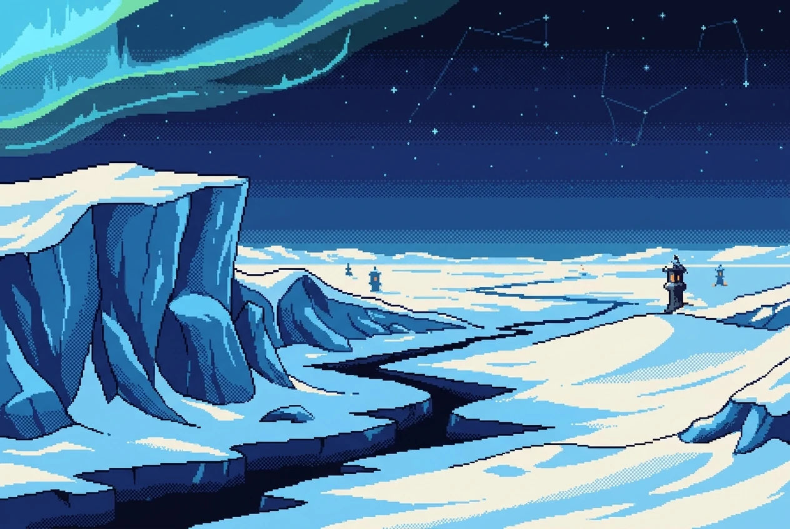
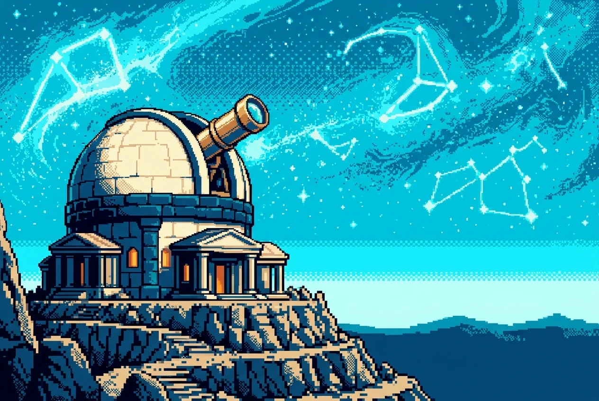

# PixelKin

<p align="center">
  
</p>

A retro, handheld-era **creature-collecting adventure** — web-first, built to
port cleanly to mobile. PixelKin sells a feeling: the wide-eyed wonder of
late-'90s handheld gaming, for the millennials who grew up on it.

👉 Start with **[`VISION.md`](VISION.md)** — what we're making and why, plus the
originality/copyright rules every contributor (human or AI) must follow.
For working in the repo, see **[`CLAUDE.md`](CLAUDE.md)**.

> ⚠️ **This is an experiment, not a commercial release.** PixelKin was built by
> [Scorchsoft](https://www.scorchsoft.com) as a **capability experiment** — to
> see how far an AI-assisted workflow could take a game from a blank repo. The
> answer turned out to be: **the whole game.** The full journey is built and
> playable — cold open → all eight Gleams across four regions → the Umbral Spire
> climax → the dawn and credits — plus a post-game (an epilogue town, a
> legendary trio, day-form collecting, and an endgame trial chain). It has not
> yet had human playtesting or device QA, so treat it as a complete *dev build*,
> not a polished product. See **[Project status](#project-status)** for detail.
>
> 📄 **Licence:** source-available, **all rights reserved** — © Scorchsoft Ltd.
> This is *not* open source. Want to build on it? **[Talk to us first](#licence).**

<p align="center">
  
  
  
  
  <br>
  <sub><i>Concept mood-pieces from <a href="docs/world/atlas.md">Vesperholm</a> — Tinderwick · Lowleaf Hollow · Pale Vault Glacier · Nightreach Observatory</i></sub>
</p>

## The game so far

The design is data-locked **and the whole journey is built**: attract demo →
title → an **illustrated cold-open prologue** (the Long Dusk, a star winking
out, the calling) → the satchel errand, the vesperlamp, and your **starter
choice** — then the full Wayfaring across **Vesperholm's four regions and ~77
maps**. South: Tinderwick's earned Beacon Gleam and Pearlmoor Quay's Tide port.
East: the Saltreach Fen channels, Lowleaf Hollow mid-festival, the Hollowing
waiting to apologise in Glowmoss Deep, and Cinderhead Mine's lamp-down vigil.
North: Galehigh's kite-rising, the Wind-Eye, and the Pale Vault glacier's
Lamp-Line trial. West: the Sunken Solarium's lit stage, the drained Coldfog
Marches (the antagonist's case, *shown*), and Nightreach Observatory's Vigil of
the Seven. Then the convergence: the parted Penumbra, the **Umbral Spire**, a
final asking that is out-remembered rather than defeated, the Keystar relight,
**the dawn** — credits — and a Continue that resumes at the summit for the
post-game: the daylit epilogue town of **Dawnstead**, Wren and Còr's gentle
resolutions, **day-form collecting** across the relit valleys, the **Three
Hours** legendary trio, and the **Starfall Vigils** endgame trial chain ending
in the hardest fight in the game. Along the way: eight earned Gleams (never
handed over flat), six traversal-gating **Lantern Gifts**, a working **wick
economy** (shops, Star-charts, trainer payouts — tuned end-to-end by a journey
model), seven battle statuses, Kindling and bond, the Hearth for kin storage,
inn rest-heals, item caches, sight trainers, festivals that fill each town
after its Gleam, a LORE codex and a collectible concept-art gallery. Progress
autosaves (with JSON export/import), and the screen can show as a
handheld-device frame, fullscreen with translucent touch controls, or plain.
Run it with `npm install && npm run dev`.

What's already in the repo:

- **A playable game engine** (Phaser 3 + TypeScript). Tile maps from our own JSON
  schema, grid movement, NPCs/signs/warps/cutscenes, a data-driven turn-based battle
  system, a **pause menu** (a party screen to inspect a kin's stats/moves and reorder
  who leads, **the Hearth** for kin storage, an items screen to heal, and a classic
  **region world map** with a you-are-here marker), and a
  flag/save layer behind the platform seam — all built on
  one in-canvas **UI design language** ([`src/game/ui/theme.ts`](src/game/ui/theme.ts))
  every screen shares. Engine code is in [`src/game/`](src/game/), the DOM
  screen-shells in [`src/shell/`](src/shell/); map/level-design rules are binding in
  [`docs/world/level-design.md`](docs/world/level-design.md), with SNES-style
  interior rules in [`docs/world/interiors.md`](docs/world/interiors.md).
- **A world & story — *The Long Dusk*.** *Vesperholm*, a crescent of valleys
  around a darkened mountain where night fell and won't lift. You play a young
  lamp-tender's apprentice relighting the sky one constellation at a time,
  against **the Hollowing** — a sympathetic, never-cartoonish movement that wants
  a gentle permanent dark. Full cast, lore, and the 14-area world map live in
  [`docs/world/`](docs/world/) — each area illustrated with a pixel-art **concept
  mood-piece** ([`assets/concept-art/`](assets/concept-art/)).
- **Creatures & battles.** **162 original *kin*** across **10 elemental types**
  (Ember, Tide, Verdant, Stone, Storm, Frost, Solar, Lunar, Light, Dark), with
  six stats, ~94 moves + 28 abilities, capture via **Lamps**, and evolution via
  **Kindling**. The roster was curated from ~463 concepts (151), rounded out by
  the third starter line and by middle/apex kindling stages (every starter is a
  three-stage line; one line kindles four stages deep), all **empirically
  balanced** with a Monte Carlo simulator (every type lands a fair win-rate). The
  data is the source of truth in [`src/game/data/`](src/game/data/); the design
  and tooling are in [`docs/mechanics/`](docs/mechanics/) and
  [`tools/balance/`](tools/balance/). Battles read their backdrop from the map —
  subtle, per-area scenes (with a few variants each) instead of flat black.
- **An original soundtrack.** Loop-ready area and battle music for the world,
  composed via the repo's music skills into
  [`public/assets/audio/music/`](public/assets/audio/music/); the per-area plan
  is in [`docs/world/music-direction.md`](docs/world/music-direction.md).
- **A visual rulebook.** Canvas sizes, palette, anchors, and the sprite pipeline
  are binding in [`docs/art-style.md`](docs/art-style.md).

Everything here is **original** — inspired by the monster-collecting genre, a
copy of nothing. See the copyright rules in [`VISION.md`](VISION.md).

## Project status

PixelKin is a **content-complete dev build** of the capability experiment: the
whole designed journey — main game, ending, and post-game — is built, wired,
and audited. What it has *not* had is human hands: no playtests, no device QA.

**Done / works today:**

- The **complete main journey**: cold open → starter → all **8 Gleams** across
  the four regions (each *earned* via its own loop, never handed over) → the
  four crowns → the **Umbral Spire** climax → Còr out-remembered → the Keystar
  relight → **the dawn**, credits, and a post-game Continue. ~77 maps, all
  walkable, with the full audit stack (reachability, warps, flow, region
  topology, foot-path) green in CI.
- The **post-game**: Dawnstead (the daylit epilogue town; Wren and Còr's
  resolutions; quests), **day-form collecting** across 22 relit maps, the
  **Three Hours** legendary trio, the two Starreach landmarks, and the
  **Starfall Vigils** — five trial sites + the Last Lesson at the summit, the
  game's first full six-kin smart-AI fights.
- A real, playable **engine** (Phaser 3 + TypeScript): tile maps, grid
  movement, data-driven cutscenes with portraits and screen FX, a turn-based
  **battle system** (statuses, Kindling, bond, smart trainer AI), the wick
  **economy** (shops, Star-charts, payouts), the pause-menu suite (party,
  Hearth, register/dex, items, LORE codex, concept-art gallery), and the
  save/flag layer behind the platform seam.
- **All 162 kin with real packed sprite art** (5 views each), the full
  **original soundtrack** (~195 area/battle/jingle tracks + SFX), per-map
  battle backdrops, and the empirically balanced battle maths (Monte Carlo
  win-rates, a journey-long XP/economy model — all gated in CI).

**Not done / known gaps:**

- **No human playtesting yet** — the golden-thread run exists as audits and an
  expert-panel review (`docs/reviews/`), not as real first-timer sessions.
- **No touch QA on real hardware**; no mobile build yet (Capacitor is planned,
  not present — the web bundle is built mobile-ready).
- A few designed-but-deferred systems: the **Lamplight** brightness-reveal
  render feature, N-of-M quest counters, and true day/night cycling
  (deliberately out of scope — the post-dawn world is a permanent swap).

In short: **the plan was complete, and now the build is too** — what remains is
the human part: playtesting, feel, and polish.

## Tech

TypeScript · [Vite](https://vitejs.dev) · [Phaser 3](https://phaser.io) —
with [Capacitor](https://capacitorjs.com) planned for the eventual mobile build
(the web `dist/` bundle becomes the mobile app).

## Quick start

```bash
npm install          # install dependencies
npm run dev          # dev server at http://localhost:5173
npm run build        # typecheck + production build to dist/
npm run build:dist   # the upload-ready bundle (shrunk audio; needs ffmpeg)
npm run preview      # serve the production build to check it before shipping
```

`npm run build:dist` is the one to ship: it typechecks, builds, then compresses
audio and strips sourcemaps into a self-contained **`dist/`**. Vite is configured
with `base: './'`, so it runs from any origin (a subfolder, or a file:// webview)
— to host the game on its own, upload the **contents of `dist/`** to your web
server. For the full pixelk.in site-plus-game bundle, use `npm run release`
(below) instead.

## Marketing site (`web/`) & deploying to pixelk.in

A small, self-contained PHP + HTML landing site lives in [`web/`](web/README.md)
— on-brand with the game (same palette and pixel font), separate from the game
build. The live host (**pixelk.in**, WHM/cPanel over FTP) serves the site at the
root and the game from `/play/`.

```bash
npm run site            # preview the site at http://localhost:8000 (PHP built-in server)

npm run release         # build the game + assemble release/ (site at /, game at /play/)
npm run release:site    # site only — refresh pages without rebuilding the game
npm run release:game    # rebuild the game + refresh only release/play/

npm run preview:release # rebuild + assemble, then serve release/ → / and /play/ both work
```

`release/` (gitignored) is the upload bundle: FTP its **contents** into
`public_html/`. The game uses Vite `base: './'`, so it runs from `/play/`
unchanged.

To play an **already-built** `release/` locally without rebuilding, serve that
folder directly:

```bash
php -S localhost:8000 -t release   # → site at /, game at /play/
```

Full notes: [`web/README.md`](web/README.md).

## Asset generation skills

Original art and music are generated via repo skills in `.claude/skills/`
(keys provided via environment; locally copy `.env.example` → `.env`):

```bash
python3 -m venv venv && ./venv/bin/pip install -r requirements.txt   # one-time

# original game music (ElevenLabs) into public/assets/audio/music/
./venv/bin/python .claude/skills/generate-music/scripts/generate_music.py --list-presets

# original art (Google Nano Banana Pro / OpenAI)
./venv/bin/python .claude/skills/generate-image/scripts/generate.py --list-styles
```

> All generated content must be **original** — inspired by the genre, a copy of
> nothing. See the copyright section in [`VISION.md`](VISION.md).

## Design & content docs

| Topic | Where |
|-------|-------|
| Vision & copyright rules | [`VISION.md`](VISION.md) |
| Story, cast, lore | [`docs/world/story-bible.md`](docs/world/story-bible.md) |
| World map (14 areas, routes, gating) | [`docs/world/atlas.md`](docs/world/atlas.md) |
| **Map renders (all 71 maps, story order)** | [`docs/maps/MAP_RENDERS.md`](docs/maps/MAP_RENDERS.md) |
| Area concept art (mood-pieces) | [`assets/concept-art/`](assets/concept-art/README.md) |
| Full walkthrough / user journey | [`docs/world/walkthrough/`](docs/world/walkthrough/README.md) |
| Soundtrack plan | [`docs/world/music-direction.md`](docs/world/music-direction.md) |
| Mechanics & balance (start here) | [`docs/mechanics/00-overview.md`](docs/mechanics/00-overview.md) |
| The full dex (all 164 kin) | [`docs/mechanics/dex.md`](docs/mechanics/dex.md) |
| Art & sprite standards | [`docs/art-style.md`](docs/art-style.md) |

## Project layout

See [`CLAUDE.md`](CLAUDE.md) for the full directory map and conventions.

## Licence

**Source-available, all rights reserved.** © 2026 **Scorchsoft Ltd**.

The code is public so you can read, learn from, and run it locally — but
publishing it here does **not** make it open source. No licence to copy, modify,
redistribute, or build a product on top of this code or its content (art, music,
text, world, and game data) is granted. See [`LICENSE`](LICENSE) for the full
terms.

Want to build on it, use it in your own project, or licence it? **Please get in
touch first** — [scorchsoft.com](https://www.scorchsoft.com).
