# PixelKin — The Dex (159)

> Generated from `src/game/data/species.json` by `tools/balance/gen_docs.py`. Every entry is original (VISION.md). Lines show kindling chains (→).

- **Total:** 159  |  **Tiers:** A:33 B:20 C:38 D:48 E:16 F:4
- **Primary types:** Ember:17  Tide:18  Verdant:20  Stone:16  Storm:17  Frost:15  Solar:15  Lunar:13  Light:16  Dark:12

## South — Tinderwick / coast (Ember, Tide)

| Art | # | Name | Types | Tier | Role | BST | Kindles | Catch | Size | Dex entry |
|:--:|--:|------|-------|:--:|------|--:|---------|--:|-----|-----------|
|  | 1 | **Vulpyre** | Ember | B | Special Sweeper | 356 | → Vulcinder (L16) | 175 | 60cm/9.4kg | It dozes on sun-warmed stones and bolts at the first drop of rain. When a Vulpyre trusts… |
|  | 2 | **Brinix** | Tide | B | Special Wall | 352 | → Brindrift (L17) | 175 | 52cm/11.5kg | Its side-fins glow softly in deep water. Brinix hums a bubbling tune that settles nervou… |
|  | 3 | **Blazethorn** | Ember | D | Special Sweeper | 498 | (from Vulcinder) | 65 | 110cm/26.5kg | The final form of the starter Vulpyre: a proud, sleek fire-fox whose mane erupts into a … |
|  | 4 | **Brinarch** | Tide | D | Special Wall | 498 | (from Brindrift) | 57 | 145cm/98kg | Brinix's final kindled form. The brine-crest has broadened into a sweeping crown of sea-… |
|  | 5 | **Wicklit** | Light/Ember | A | Disruptor / Status | 312 | → Wickmere (L16) | 210 | 9cm/0.04kg | A matchstick sprite, barely the height of a thumb, that ignites itself to draw attention… |
|  | 6 | **Wickmere** | Light/Ember | B | Disruptor / Status | 350 | → Wicklord (L32) | 175 | 55cm/3.1kg | A half-grown candle-folk that has learned to shape its wax body mid-battle, flowing arou… |
|  | 7 | **Wicklord** | Light/Ember | D | Special Tank | 498 | (from Wickmere) | 57 | 160cm/42kg | A regal candelabra-kin whose body is a flowing pillar of warm wax lined with seven blazi… |
|  | 8 | **Glimflit** | Light | A | Utility / Speedster | 312 | → Glimscout (L20) | 210 | 8cm/0.05kg | A tiny firefly-sprite that bobs through Tinderwick's evening air, its tail-lantern blink… |
|  | 9 | **Glimscout** | Light | D | Utility / Speedster | 498 | (from Glimflit) | 65 | 38cm/1.2kg | A grown firefly-courier that blazes a trail of lingering glow-motes wherever it streaks,… |
|  | 10 | **Tallowpup** | Ember | A | Balanced / Pivot | 312 | → Tallowcrest (L14) | 210 | 28cm/4.2kg | A stumpy wax-coated pup whose stubby tail is a flickering tallow candle that warms every… |
|  | 11 | **Tallowcrest** | Ember | C | Balanced / Pivot | 418 | → Chandrek (L28) | 120 | 62cm/14.5kg | A mid-sized candle-hound with a crown of five dripping tallow flames that shift colour d… |
|  | 12 | **Chandrek** | Ember/Light | D | Special Tank | 498 | (from Tallowcrest) | 57 | 110cm/48.0kg | A great candlewood hound whose entire mane is a cathedral of living candles, radiating w… |
|  | 13 | **Ashlette** | Ember | A | Special Sweeper | 312 | → Embrift (L13) | 210 | 15cm/0.3kg | A tiny ash-fairy that drifts on warm updrafts, trailing grey motes; when it sneezes, it … |
|  | 14 | **Embrift** | Ember | C | Special Sweeper | 418 | → Pyriven (L32) | 120 | 60cm/2.1kg | A swirling ash-sprite that has grown a permanent vortex of superheated cinders around it… |
|  | 15 | **Pyriven** | Ember/Dark | D | Special Sweeper | 498 | (from Embrift) | 57 | 175cm/8.0kg | A towering cinder-wraith whose body is a column of black smoke wreathed in fierce orange… |
|  | 16 | **Wickmoth** | Ember | A | Glass Cannon | 312 | → Scorchwing (L18) | 210 | 22cm/0.8kg | A small ember-winged moth that navigates by following warm light and scorches anything i… |
|  | 17 | **Scorchwing** | Ember | D | Glass Cannon | 498 | (from Wickmoth) | 65 | 75cm/5.2kg | A magnificent ember-moth with broad, vein-lit wings that trail blazing filaments and lea… |
|  | 18 | **Hearthkit** | Ember | A | Balanced / Pivot | 312 | → Warmantis (bond) | 210 | 24cm/2.2kg | A small round hearth-fox kitten that nests inside unused fireplaces and glows soft amber… |
|  | 19 | **Warmantis** | Ember/Light | D | Balanced / Pivot | 498 | (from Hearthkit) | 57 | 95cm/19.0kg | The hearth-kitten has grown into a luminous fire-cat that forms a bond so deep it can pr… |
|  | 20 | **Tidmote** | Tide/Light | A | Utility / Speedster | 312 | → Tidmaren (L13) | 210 | 8cm/0.1kg | A tiny darting water-sprite that skims the sea surface, trailing a thread of moonlit wat… |
|  | 21 | **Tidmaren** | Tide/Light | C | Utility / Speedster | 418 | → Tidwraith (L28) | 120 | 48cm/3.2kg | The water-sprite is now a swift silver shape that dances between moonbeams, spreading br… |
|  | 22 | **Tidwraith** | Tide/Light | D | Utility / Speedster | 498 | (from Tidmaren) | 57 | 110cm/8kg | The fully kindled water-light sprite — now a ghostly shining figure of pure tide-light t… |
|  | 23 | **Glintfin** | Tide/Light | A | Special Sweeper | 312 | → Shimmral (L15) | 210 | 12cm/0.3kg | A small glinting schooling fish with a single prismatic scale that acts like a signal mi… |
|  | 24 | **Shimmral** | Tide/Light | C | Special Sweeper | 418 | → Prismare (L30) | 120 | 55cm/8.5kg | The glintfin shoal has merged into a single larger fish with a spectacular prismatic fin… |
|  | 25 | **Prismare** | Tide/Light | D | Special Sweeper | 498 | (from Shimmral) | 57 | 130cm/48kg | The fully kindled form — a magnificent reef-fish whose entire body is a living prism. Li… |
|  | 26 | **Brinelet** | Tide | A | Utility / Speedster | 312 | → Brineroll (L14) | 210 | 18cm/0.9kg | A tiny round tidepool creature that rolls with the surf, collecting trinkets in a dimple… |
|  | 27 | **Brineroll** | Tide | C | Utility / Speedster | 418 | → Brinewrath (L28) | 120 | 40cm/6.5kg | Brinelet has grown a proper ridged shell and longer fins, tumbling through shallows with… |
|  | 28 | **Brinewrath** | Tide | D | Utility / Speedster | 498 | (from Brineroll) | 57 | 110cm/52kg | The line's final form — a sleek armoured tidal-beast that rides currents at high speed, … |
|  | 29 | **Glostern** | Tide/Light | B | Special Sweeper | 350 | → Glostrael (L26) | 175 | 28cm/0.4kg | A small jellyfish-lantern drifting through Pearlmoor harbour. Its translucent bell glows… |
|  | 30 | **Glostrael** | Tide/Light | D | Special Sweeper | 498 | → Pharolux (L48) | 57 | 180cm/12kg | Glostern's kindled form — its bell has expanded enormously and its moon-glow fills the s… |
|  | 31 | **Lumpin** | Tide/Light | B | Special Wall | 350 | → Lumplass (L22) | 175 | 22cm/1.4kg | A limpet-kin whose flat shell glows with stored moonlight. It clings to coastal rocks an… |
|  | 32 | **Lumplass** | Tide/Light | D | Special Wall | 498 | (from Lumpin) | 65 | 65cm/28kg | Lumpin's shell has fused into a radiant broad disc; it now clings to sea-cliff faces and… |
|  | 33 | **Embralux** | Ember/Light | E | Special Sweeper | 558 |  | 24 | 160cm/52kg | An apex Ember/Light candidate for the south region's secret Lumenary approach — a great … |
|  | 34 | **Tideveil** | Tide/Light | E | Special Wall | 558 |  | 24 | 1800cm/4200kg | The Tide Constellation Warden — a vast, semi-transparent sea-spirit that dwells in the T… |
|  | 152 | **Cloverkit** | Verdant | B | Physical Bruiser | 356 | → Cloverbuck (L18) | 175 | 45cm/6.5kg | A sprout-cub that wears a four-leaf clover like a tiny lantern-leaf; in the Long Dusk th… |
| 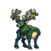 | 153 | **Cloverhart** | Verdant | D | Physical Bruiser | 498 | (from Cloverbuck) | 57 | 165cm/98kg | Cloverkit's kindled form: a great clover-crowned stag whose antlers bloom with year-roun… |
|  | 154 | **Vulcinder** | Ember | C | Special Sweeper | 418 | → Blazethorn (L34) | 112 | 95cm/19.5kg | Vulpyre's kindled middle form — a lean adolescent ember-fox caught between kit and crown… |
|  | 155 | **Brindrift** | Tide | C | Special Wall | 418 | → Brinarch (L35) | 112 | 110cm/42kg | Brinix's kindled middle form — a broader, current-riding shell-back that has learned to … |
|  | 156 | **Cloverbuck** | Verdant | C | Physical Bruiser | 418 | → Cloverhart (L36) | 112 | 105cm/34kg | Cloverkit's kindled middle form — a young grove buck whose first antlers have budded as … |
|  | 157 | **Pharolux** | Tide/Light | E | Special Sweeper | 558 | (from Glostrael) | 24 | 380cm/210kg | Glostrael's rare apex kindling — a vast lantern-bell leviathan the old quay-folk call th… |

## East — Lowleaf & Cinderhead (Verdant, Stone)

| Art | # | Name | Types | Tier | Role | BST | Kindles | Catch | Size | Dex entry |
|:--:|--:|------|-------|:--:|------|--:|---------|--:|-----|-----------|
|  | 35 | **Crystink** | Stone/Light | A | Special Sweeper | 312 | → Lumecite (L19) | 210 | 12cm/0.3kg | A small crystal-beetle whose wing-cases are faceted like cut gems; it scurries through t… |
|  | 36 | **Lumecite** | Stone/Light | C | Special Sweeper | 418 | → Prismara (L38) | 112 | 115cm/90kg | A radiant crystal-stag whose antlers are grown entirely from pure luminous diamond cryst… |
|  | 37 | **Prismara** | Stone/Light | E | Special Sweeper | 558 | (from Lumecite) | 24 | 240cm/800kg | The apex Stone/Light crystal kin of the Crystoll Vault — a towering crystal-stag whose e… |
|  | 38 | **Mossglow** | Light/Verdant | A | Disruptor / Status | 312 | → Mossmantle (L18) | 210 | 18cm/1.4kg | A fuzzy moss-ball that slowly rolls through the forest floor of Lowleaf Hollow, leaving … |
|  | 39 | **Mossmantle** | Light/Verdant | C | Disruptor / Status | 418 | → Lumenmoss (L34) | 120 | 88cm/14kg | A half-formed moss-treeling that has grown a cloak of living bioluminescent fronds; when… |
|  | 40 | **Lumenmoss** | Light/Verdant | D | Physical Wall | 498 | (from Mossmantle) | 57 | 220cm/180kg | An ancient moss-lord of the Hollow whose entire body is a cathedral of bioluminescent gr… |
|  | 41 | **Scorchite** | Ember | A | Special Sweeper | 312 | → Coalump (L14) | 210 | 12cm/0.9kg | A marble-sized wandering coal-sprite with a single bright eye; it rolls into warm crevic… |
|  | 42 | **Coalump** | Ember | C | Special Sweeper | 418 | → Pyrolith (L30) | 120 | 50cm/18.0kg | The little coal-sprite has absorbed enough heat to grow limbs and a second eye; its body… |
|  | 43 | **Pyrolith** | Ember/Stone | D | Special Sweeper | 498 | (from Coalump) | 57 | 180cm/320.0kg | A crystallised magma-titan whose body has solidified into angular obsidian with a blazin… |
| 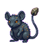 | 44 | **Flickore** | Stone/Storm | A | Special Sweeper | 312 | → Sparkrat (L17) | 210 | 22cm/0.9kg | A small static-furred rodent whose iron-ore-flecked pelt crackles with friction sparks a… |
|  | 45 | **Sparkrat** | Stone/Storm | C | Special Sweeper | 418 | → Voltcrag (L32) | 120 | 55cm/9kg | A larger, more confident ore-rodent whose entire coat is threaded with conductive minera… |
|  | 46 | **Voltcrag** | Stone/Storm | D | Special Sweeper | 498 | (from Sparkrat) | 57 | 145cm/220kg | A large, heavily-built ore-beast that acts as a living conductor; veins of metallic mine… |
|  | 47 | **Pebbit** | Stone | A | Balanced / Pivot | 312 | → Rubbol (L18) | 210 | 14cm/1.8kg | A round pebble-sprite no larger than a fist that clings to cave walls with adhesive ston… |
|  | 48 | **Rubbol** | Stone | C | Balanced / Pivot | 418 | → Gravelo (L30) | 120 | 62cm/48kg | A stocky boulder-torso kin with a cracked surface revealing faint mineral veins; it roll… |
|  | 49 | **Gravelo** | Stone | D | Physical Wall | 498 | (from Rubbol) | 57 | 140cm/310kg | A broad, slow-moving tortoise whose domed shell is encrusted with genuine crystal growth… |
| 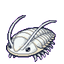 | 50 | **Fossik** | Stone | A | Balanced / Pivot | 312 | → Crevasser (L20) | 210 | 16cm/0.4kg | A small fossil-shrimp kin that has come back to life; its carapace is the hard chalk-whi… |
|  | 51 | **Crevasser** | Stone | C | Balanced / Pivot | 418 | → Lithonyx (L36) | 120 | 75cm/55kg | A revived fossil-crustacean that has grown larger and harder; its shell now has genuine … |
|  | 52 | **Lithonyx** | Stone | D | Physical Bruiser | 498 | (from Crevasser) | 57 | 200cm/650kg | A massive revived fossil-predator whose carapace has grown thick enough to shrug off cav… |
|  | 53 | **Oreling** | Stone | A | Physical Bruiser | 312 | → Orebound (L16) | 210 | 18cm/3kg | A dumpling-shaped cave-grub with a body fused to a piece of raw iron ore; it headbutts w… |
|  | 54 | **Orebound** | Stone | C | Physical Bruiser | 418 | → Ferrolith (L34) | 120 | 80cm/95kg | A stocky bipedal kin that has grown up around its ore core; fists and elbows reinforced … |
|  | 55 | **Ferrolith** | Stone | D | Physical Bruiser | 498 | (from Orebound) | 57 | 220cm/1100kg | A massive iron-ore golem whose body is now a dense interlock of stone and metal; each st… |
|  | 56 | **Sporeling** | Verdant | A | Disruptor / Status | 312 | → Sporemid (L14) | 210 | 20cm/1.2kg | A tiny mushroom-cap sprite native to Lowleaf Hollow. Its cap glows faintly and pulses wh… |
|  | 57 | **Sporemid** | Verdant | C | Disruptor / Status | 418 | → Mycelarch (L28) | 120 | 80cm/28kg | A taller, more confident mushroom-kin with a fully developed cap and a ring of satellite… |
|  | 58 | **Mycelarch** | Verdant/Dark | D | Disruptor / Status | 498 | (from Sporemid) | 57 | 240cm/580kg | The ancient lord of the Spore Grotto, a towering fungal entity whose underground myceliu… |
|  | 59 | **Dewling** | Verdant/Tide | A | Special Sweeper | 312 | → Poolfrond (L13) | 210 | 12cm/0.3kg | A droplet-shaped seedling that lives in pools of forest dew. It is translucent, with a s… |
|  | 60 | **Poolfrond** | Verdant/Tide | C | Special Sweeper | 418 | → Tidalarch (L26) | 120 | 80cm/32kg | A lily-pad kin that glides on still forest pools. Its broad flat body floats on the surf… |
|  | 61 | **Tidalarch** | Verdant/Tide | D | Special Sweeper | 498 | (from Poolfrond) | 57 | 500cm/1100kg | A great water-plant entity that spans a pool entirely, raising arching vine-bridges of w… |
| 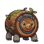 | 62 | **Barkhelm** | Verdant/Stone | A | Physical Wall | 312 | → Stonebark (L16) | 210 | 18cm/4kg | A sturdy tortoise-like creature whose shell is made of compressed bark and stone. It sle… |
|  | 63 | **Stonebark** | Verdant/Stone | C | Physical Wall | 418 | → Rootwarden (L32) | 120 | 90cm/185kg | A medium bark-golem that moves with deliberate slowness. Its bark-ring shell has mineral… |
|  | 64 | **Rootwarden** | Verdant/Stone | D | Physical Wall | 498 | (from Stonebark) | 57 | 280cm/1800kg | An ancient bark-golem so old that saplings have begun growing from its back. It stands i… |
|  | 65 | **Glowsip** | Verdant/Light | B | Special Tank | 350 | → Lumournis (L19) | 175 | 22cm/2.5kg | A small nectar-moth larva that drinks bioluminescent glowmoss dew, storing liquid light … |
|  | 66 | **Lumournis** | Verdant/Light | D | Special Tank | 498 | (from Glowsip) | 65 | 130cm/18kg | A grand glowing moth whose wings are broad leaf-panels veined with bioluminescent channe… |
| 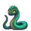 | 67 | **Fennlight** | Verdant/Light | B | Special Sweeper | 350 | → Fernlance (L20) | 175 | 65cm/4kg | A lithe glowing fern-serpent native to Lowleaf Hollow's bioluminescent undergrowth. Its … |
| 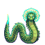 | 68 | **Fernlance** | Verdant/Light | D | Special Sweeper | 498 | (from Fennlight) | 57 | 380cm/95kg | A fully adult fern-serpent, now as long as a felled tree, wreathed in blazing biolumines… |
|  | 69 | **Riddlestone** | Stone | C | Special Wall | 418 |  | 120 | 120cm/240kg | A sphinx-like cave construct that has formed naturally from layered sedimentary stone; i… |
|  | 70 | **Mycovast** | Verdant/Stone | E | Special Tank | 558 |  | 24 | 300cm/2200kg | The apex kin of Spore Grotto — a vast, ancient fungal titan that has been growing throug… |

## North — Galehigh & Pale Vault (Storm, Frost)

| Art | # | Name | Types | Tier | Role | BST | Kindles | Catch | Size | Dex entry |
|:--:|--:|------|-------|:--:|------|--:|---------|--:|-----|-----------|
|  | 71 | **Iceling** | Frost | A | Balanced / Pivot | 312 | → Glaceling (L16) | 210 | 18cm/2.5kg | A small, round ice-sprite no bigger than a fist that forms spontaneously wherever glacie… |
|  | 72 | **Glaceling** | Frost | C | Balanced / Pivot | 418 | → Frostholm (L34) | 120 | 55cm/12kg | A more developed ice-sprite that has gathered enough ambient ice to give itself a more d… |
|  | 73 | **Frostholm** | Frost/Light | E | Special Wall | 558 | (from Glaceling) | 24 | 620cm/14000kg | The apex form of the ice-sprite lineage — a vast, ancient glacier-golem that has accumul… |
|  | 74 | **Geolace** | Frost/Stone | A | Physical Bruiser | 312 | → Geodrake (L18) | 210 | 25cm/8.5kg | A small, crystalline geode-crab whose outer shell is a natural geode split down the midd… |
|  | 75 | **Geodrake** | Frost/Stone | C | Physical Bruiser | 418 | → Vaultclaw (L36) | 112 | 65cm/48kg | A mid-sized geode-armoured crustacean that has grown additional crystal growths along it… |
|  | 76 | **Vaultclaw** | Frost/Stone | D | Physical Bruiser | 498 | (from Geodrake) | 57 | 195cm/680kg | A colossal glacier-hermit whose geode shell has become a literal ice-cave it carries. Th… |
|  | 77 | **Chillpip** | Frost | A | Balanced / Pivot | 312 | → Crystarn (L14) | 210 | 22cm/1.8kg | A plump little snow-chick with a soft fluff coat of powder-white down. The ice crystals … |
|  | 78 | **Crystarn** | Frost | C | Balanced / Pivot | 418 | → Glacitern (L30) | 120 | 58cm/6.5kg | A half-grown snow-bird that has shed its chick-fluff for proper iridescent feathers unde… |
|  | 79 | **Glacitern** | Frost/Storm | D | Physical Sweeper | 498 | (from Crystarn) | 57 | 140cm/28kg | A fully matured blizzard-tern of startling size. Its wings generate localised ice-laced … |
|  | 80 | **Snowcune** | Frost | A | Special Sweeper | 312 | → Blizzrhare (L17) | 210 | 34cm/3.6kg | A playful little snow-hare with oversized feet perfect for bounding across deep powder. … |
|  | 81 | **Blizzrhare** | Frost | C | Special Sweeper | 418 | → Vortexlope (L35) | 120 | 72cm/9.8kg | A mid-form hare that has shed its soft pup-coat for sleek winter fur hardened into wind-… |
|  | 82 | **Vortexlope** | Frost/Storm | D | Glass Cannon | 498 | (from Blizzrhare) | 57 | 145cm/32kg | A blizzard-speed hare of remarkable size whose constant motion generates a persistent pe… |
|  | 83 | **Hushvole** | Frost | A | Disruptor / Status | 312 | → Hushbore (L16) | 210 | 18cm/1.2kg | A small, round snow-vole that buries itself just below the glacier surface and pops up t… |
|  | 84 | **Hushbore** | Frost | C | Disruptor / Status | 418 | → Stillwarden (L34) | 120 | 52cm/14kg | A mid-sized burrowing rodent with thickened ice-plated shoulder pads from tunnelling thr… |
|  | 85 | **Stillwarden** | Frost/Dark | D | Disruptor / Status | 498 | (from Hushbore) | 57 | 130cm/95kg | A massive glacier-burrower whose silence aura has expanded to blanket entire cave system… |
|  | 86 | **Prismcub** | Light/Frost | A | Balanced / Pivot | 312 | → Prismantus (L22) | 210 | 38cm/9kg | A round-eared ice-bear cub of the Pale Vault Glacier whose fur is threaded with prism-cr… |
|  | 87 | **Prismantus** | Light/Frost | D | Physical Bruiser | 498 | (from Prismcub) | 57 | 200cm/320kg | A fully grown glacier-bear whose crystal-fur has solidified into great diamond-hard pris… |
|  | 88 | **Sparrowcaw** | Storm | A | Glass Cannon | 312 | → Flintbeak (L23) | 210 | 12cm/0.2kg | A scrappy little terrace-sparrow that pecks spark-producing pyrite from the cliff walls … |
|  | 89 | **Flintbeak** | Storm | C | Glass Cannon | 418 | → Strikeaven (L35) | 120 | 55cm/3.8kg | A mid-stage strike-bird whose beak has hardened into a flint-edged chisel that sparks on… |
|  | 90 | **Strikeaven** | Storm | D | Glass Cannon | 498 | (from Flintbeak) | 57 | 120cm/16.5kg | The apex flint-raven: a large, sleek storm-bird whose entire beak has become a solid sta… |
|  | 91 | **Cirruff** | Storm/Light | B | Balanced / Pivot | 350 | → Nimbruff (L25) | 175 | 30cm/1.8kg | A cloud-fluff pup born inside a high cirrus cloud; its fur is made of compressed cloud-s… |
|  | 92 | **Nimbruff** | Storm/Light | C | Balanced / Pivot | 418 | → Cumulance (L36) | 120 | 75cm/12.0kg | The cloud-pup's fur has densified into cumulonimbus wool that flashes with internal ligh… |
|  | 93 | **Cumulance** | Storm/Light | D | Balanced / Pivot | 498 | (from Nimbruff) | 57 | 170cm/52.0kg | The cloud-hound's final form — a great silver-and-gold stormhound whose body is a living… |
|  | 94 | **Hailwhirr** | Storm/Frost | B | Special Sweeper | 350 | → Glacewing (L26) | 175 | 18cm/0.4kg | A small blizzard-wasp native to the high passes above Galehigh, spinning frost crystals … |
|  | 95 | **Glacewing** | Storm/Frost | C | Special Sweeper | 418 | → Frigalance (L36) | 120 | 55cm/3.5kg | A mid-stage blizzard-wasp that has grown compound crystal eyes and whose wingbeats creat… |
|  | 96 | **Frigalance** | Storm/Frost | D | Special Sweeper | 498 | (from Glacewing) | 57 | 110cm/9.0kg | The apex blizzard-wasp: a slender, blade-like creature that moves through lightning-char… |
|  | 97 | **Thrumvane** | Storm | B | Disruptor / Status | 350 | → Thrumble (L24) | 175 | 25cm/3.2kg | A small, plump kin whose tail spins like a weathervane in wind; the rotation charges a s… |
|  | 98 | **Thrumble** | Storm | C | Disruptor / Status | 418 | → Vortavane (L34) | 120 | 65cm/12.5kg | A mid-stage kin whose vane-tail has grown wider and generates a continuous hum of low-fr… |
| 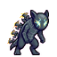 | 99 | **Vortavane** | Storm | D | Disruptor / Status | 498 | (from Thrumble) | 57 | 140cm/48.0kg | The apex vane-beast: a tall, regal kin whose entire dorsal spine has become a bank of sp… |
|  | 100 | **Squallox** | Storm | B | Physical Sweeper | 350 | → Galefox (L25) | 175 | 32cm/3.8kg | A gust-fox kit born on the exposed upper terraces, its tail a perpetual blurred blur of … |
| 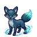 | 101 | **Galefox** | Storm | C | Physical Sweeper | 418 | → Tempestail (L35) | 120 | 80cm/14.5kg | A sleek mid-stage gust-fox who now runs so fast it creates a visible bow-wave of compres… |
|  | 102 | **Tempestail** | Storm | D | Physical Sweeper | 498 | (from Galefox) | 57 | 145cm/40.0kg | The apex gust-fox — a lithe, white-silver predator whose tail is now a visible thunderst… |

## West — Solarium & Nightreach (Solar, Lunar)

| Art | # | Name | Types | Tier | Role | BST | Kindles | Catch | Size | Dex entry |
|:--:|--:|------|-------|:--:|------|--:|---------|--:|-----|-----------|
|  | 103 | **Gilpaw** | Solar/Stone | A | Physical Wall | 312 | → Goldmane (L28) | 210 | 38cm/22.0kg | A small leonine cub whose coat has mineralised into gilded stone plates, soaking up ambi… |
|  | 104 | **Goldmane** | Solar/Stone | D | Physical Bruiser | 498 | → Corolion (L47) | 57 | 155cm/210.0kg | A gilded stone lion whose mane has erupted into a crown of solar-flare spines; it stores… |
|  | 105 | **Snoozlet** | Lunar | A | Balanced / Pivot | 312 | → Drowshorn (L16) | 210 | 32cm/7.5kg | A drowsy round moon-sheep that drifts half-awake through the Nightreach highlands, trail… |
|  | 106 | **Drowshorn** | Lunar | C | Balanced / Pivot | 418 | → Lunarbel (L33) | 120 | 85cm/38.0kg | A mid-sized dream-ram whose crescent horns have grown into proper moon-arcs that hum wit… |
|  | 107 | **Lunarbel** | Lunar/Light | D | Special Tank | 498 | (from Drowshorn) | 57 | 155cm/88.0kg | A great moon-ram whose wool has become a cascade of solidified moonlight, each strand a … |
|  | 108 | **Solunet** | Lunar/Tide | A | Special Sweeper | 312 | → Tidalune (L14) | 210 | 16cm/0.4kg | A little moon-tide sprite shaped like a water-drop with a crescent inside; it skips acro… |
|  | 109 | **Tidalune** | Lunar/Tide | C | Special Sweeper | 418 | → Lunaquell (L32) | 120 | 55cm/18.0kg | A moon-tide sprite that has gathered enough water to form a proper fluid body, hovering … |
|  | 110 | **Lunaquell** | Lunar/Tide | D | Special Sweeper | 498 | (from Tidalune) | 57 | 195cm/340.0kg | The tide-moon spirit in its full form: a vast oceanic omen-being whose water-sphere has … |
|  | 111 | **Spirlet** | Lunar | A | Disruptor / Status | 312 | → Nightwraith (L15) | 210 | 18cm/0.05kg | A tiny night-spirit sprite that looks like a faint crescent cut from silver tissue paper… |
|  | 112 | **Nightwraith** | Lunar | C | Disruptor / Status | 418 | → Omenire (L30) | 120 | 70cm/0.8kg | A mid-stage moon-spirit that has grown a veil of dark mist around its crescent core; it … |
|  | 113 | **Omenire** | Lunar/Dark | D | Disruptor / Status | 498 | (from Nightwraith) | 57 | 175cm/4.5kg | A towering eclipse-spirit whose crescent core is now fully ringed by a disc of null-dark… |
|  | 114 | **Sunsprout** | Verdant/Solar | A | Balanced / Pivot | 312 | → Solvyne (L20) | 210 | 32cm/5.4kg | A compact sun-flower bulb kin that drifted into the Sunken Solarium long ago and absorbe… |
|  | 115 | **Solvyne** | Verdant/Solar | C | Balanced / Pivot | 418 | → Auravane (L36) | 112 | 90cm/18.2kg | A tall vine-wreathed sun-fae whose open flower-crown channels stored daylight into its s… |
|  | 116 | **Auravane** | Verdant/Solar | D | Special Tank | 498 | (from Solvyne) | 57 | 165cm/94.0kg | A great solar-vine sovereign whose canopy of golden petals releases stored daylight in w… |
|  | 117 | **Helibud** | Solar | B | Utility / Speedster | 350 | → Helicore (L25) | 175 | 26cm/3.9kg | A rolling solar-seed that bounced free of the Solarium's golden arches; it spins constan… |
|  | 118 | **Helicore** | Solar | C | Utility / Speedster | 418 | → Helithorn (L40) | 112 | 55cm/14.0kg | A solar orb kin that has cracked open slightly to reveal a molten amber core; the spinni… |
|  | 119 | **Helithorn** | Solar | E | Glass Cannon | 558 | (from Helicore) | 24 | 130cm/48.0kg | The fully awakened solar apex — the outer shell has burst open into a ring of eight radi… |
|  | 120 | **Dawnfawn** | Solar/Verdant | B | Utility / Speedster | 350 | → Sunstag (L30) | 175 | 62cm/12.5kg | A young sun-stag fawn whose antler stubs are flowering sun-vine shoots; it drinks stored… |
|  | 121 | **Sunstag** | Solar/Verdant | D | Physical Sweeper | 498 | (from Dawnfawn) | 57 | 190cm/155.0kg | A great dawn-stag with a full crown of antlers wreathed in blooming sun-vine flowers; ea… |
|  | 122 | **Solray** | Solar | B | Special Sweeper | 350 | → Solreach (L30) | 175 | 44cm/5.2kg | A flat, disc-shaped solar ray-fish that drifts through the Solarium's flooded halls like… |
|  | 123 | **Solreach** | Solar | D | Special Sweeper | 498 | (from Solray) | 57 | 190cm/38.0kg | A vast solar disc-ray that has doubled in size and brightness, now trailing twelve long … |
|  | 124 | **Petalune** | Lunar/Frost | B | Utility / Speedster | 350 | → Crystalune (L28) | 175 | 40cm/0.9kg | A quick frost-moth with wings patterned in delicate ice-crystal mandalas that catch moon… |
|  | 125 | **Crystalune** | Lunar/Frost | D | Utility / Speedster | 498 | (from Petalune) | 57 | 110cm/8.5kg | A large moon-moth whose wings have crystallised into translucent ice-panels etched with … |
|  | 126 | **Lunveil** | Light/Lunar | B | Disruptor / Status | 350 | → Lunvane (L28) | 175 | 55cm/0.9kg | A silvery curtain-moth near the Nightreach Observatory, its wings folded like shut eyeli… |
|  | 127 | **Lunvane** | Light/Lunar | D | Disruptor / Status | 498 | (from Lunveil) | 57 | 180cm/3.2kg | A vast lunar-herald moth whose wing-span casts a moon-shadow over the battlefield; it co… |
|  | 128 | **Solarmourn** | Solar | E | Balanced / Pivot | 558 |  | 24 | 195cm/85kg | The luminous anchor of the Solar Constellation, a great heron-phoenix whose plumage is t… |
|  | 129 | **Dawnwatcher** | Lunar/Light | E | Special Tank | 558 |  | 24 | 280cm/95.0kg | The sub-legendary apex of the Lunar constellation — a great celestial heron of crystalli… |
|  | 130 | **Heliovast** | Solar | E | Special Sweeper | 558 |  | 24 | 250cm/280kg | Sealed inside the Helia Vault — a reliquary off Sunvault Climb whose door can only be un… |
|  | 131 | **Helixia** | Solar | E | Special Sweeper | 558 |  | 24 | 150cm/88.0kg | The Helia Vault's guardian: a great solar apex kin shaped like a living orrery, its body… |
|  | 132 | **Lunaveil** | Lunar | E | Utility / Speedster | 558 |  | 24 | 320cm/140kg | The luminous anchor of the Lunar Constellation, a silken serpent-moth of impossible size… |
|  | 158 | **Corolion** | Solar/Stone | E | Physical Bruiser | 558 | → Dawnregent (L56) | 24 | 240cm/410kg | Goldmane's apex kindling — a crowned sun-lion whose stone mane has fused into a full cor… |
|  | 159 | **Dawnregent** | Solar/Light | F | Physical Bruiser | 642 | (from Corolion) | 6 | 320cm/180kg | The fourth and final kindling of the Gilpaw line, reached only by a Corolion raised far … |

## Outer — Coldfog Marches (Dark)

| Art | # | Name | Types | Tier | Role | BST | Kindles | Catch | Size | Dex entry |
|:--:|--:|------|-------|:--:|------|--:|---------|--:|-----|-----------|
|  | 133 | **Flutterwane** | Dark/Light | A | Utility / Speedster | 312 | → Wispwane (L22) | 210 | 12cm/0.2kg | A tiny will-o'-wisp no bigger than a fist, its glow cycling between warm amber and drain… |
|  | 134 | **Wispwane** | Dark/Light | C | Disruptor / Status | 418 | → Liminalux (L38) | 112 | 45cm/1.4kg | A wisp caught between the Skyweave and the Hollowing — half its body radiates pale golde… |
|  | 135 | **Liminalux** | Dark/Light | D | Special Tank | 498 | (from Wispwane) | 57 | 70cm/9.5kg | The resolved form of a wisp that survived the Hollowing's full pull and did not fall ent… |
|  | 136 | **Mothdim** | Dark | A | Utility / Speedster | 312 | → Nullmoth (L20) | 210 | 8cm/0.1kg | A small grey moth whose wing-eyes were once luminous but are now flat and lightless — as… |
|  | 137 | **Nullmoth** | Dark | C | Disruptor / Status | 418 | → Voidmantle (L36) | 120 | 22cm/0.8kg | A palm-sized moth draped in velvet-grey wings that shed fine null-dust — a powder that d… |
|  | 138 | **Voidmantle** | Dark | D | Disruptor / Status | 498 | (from Nullmoth) | 57 | 95cm/6.2kg | A large, crepuscular moth whose wingspan fills a doorway. Its wings are so saturated wit… |
|  | 139 | **WispwaneNull** | Dark/Light | B | Disruptor / Status | 350 | → Wisprestored (L30) | 175 | 25cm/0.1kg | A guttering will-o'-wisp of the Coldfog Marches — a Light kin slowly drained by the Holl… |
|  | 140 | **Wisprestored** | Light | D | Balanced / Pivot | 498 | (from WispwaneNull) | 57 | 60cm/0.3kg | When a Wispwane is loved and re-kindled, the Hollowing's taint burns away and it blazes … |
| 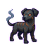 | 141 | **Cindersob** | Dark/Ember | B | Glass Cannon | 350 | → Embergone (L30) | 175 | 35cm/5.8kg | A small creature shaped like a charred ember-hound pup — the hollowed remnant of a once-… |
| 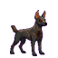 | 142 | **Embergone** | Dark/Ember | D | Glass Cannon | 498 | (from Cindersob) | 57 | 88cm/28kg | The snuffed final form of a proud ember-kin lineage — a tall hound whose once-brilliant … |
|  | 143 | **Whorlix** | Storm/Dark | C | Disruptor / Status | 418 |  | 112 | 100cm/2.0kg | A storm-husk kin that drifted in from the Coldfog Marches: a hollow shell of compressed … |
|  | 144 | **Nullhusk** | Storm/Dark | E | Disruptor / Status | 558 |  | 24 | 220cm/240kg | The charged husk of the Hollowfen Stillworks — a derelict Hollowing null-works set-piece… |
| 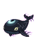 | 145 | **Cindervast** | Dark | E | Special Sweeper | 558 |  | 24 | 900cm/45000kg | The Drownlight Beacon sub-legendary — a vast shadow-whale that was once a Solar-type cel… |
|  | 146 | **Bogvast** | Dark | E | Physical Wall | 558 |  | 24 | 420cm/4800kg | An enormous null-beast that has become part of the coldfog marshes themselves — its body… |

## Central — Umbral Spire (legendaries)

| Art | # | Name | Types | Tier | Role | BST | Kindles | Catch | Size | Dex entry |
|:--:|--:|------|-------|:--:|------|--:|---------|--:|-----|-----------|
|  | 147 | **Skyweavelet** | Light | B | Utility / Speedster | 350 |  | 175 | 20cm/0.02kg | A mote of the Skyweave itself given semi-sapient form — a thread-sprite that weaves smal… |
|  | 148 | **Lampling** | Light | C | Special Wall | 418 |  | 112 | 42cm/3.8kg | The beloved mascot of Vesper Crossroads — a sentient vesperlamp kin that has been glowin… |
|  | 149 | **Keylumen** | Light | F | Balanced / Pivot | 642 |  | 6 | 300cm/240kg | The Keystar-kin. At the heart of the Umbral Spire, sealed within the Ninth Lantern, rest… |
|  | 150 | **Nullmajor** | Dark | F | Special Sweeper | 642 |  | 6 | 450cm/240kg | Warden Còr's drained final-boss kin — the embodiment of the Great Null, the shape that a… |

## Post-game — Dawnstead

| Art | # | Name | Types | Tier | Role | BST | Kindles | Catch | Size | Dex entry |
|:--:|--:|------|-------|:--:|------|--:|---------|--:|-----|-----------|
|  | 151 | **Dawnbrael** | Solar/Light | F | Physical Sweeper | 642 |  | 6 | 280cm/340kg | The Dawn Legendary — the kin that was always there, sleeping beneath Dawnstead in a seal… |