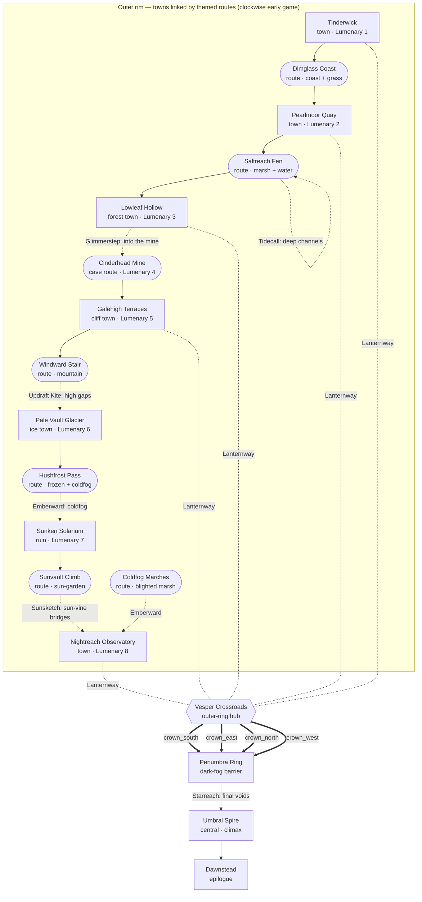
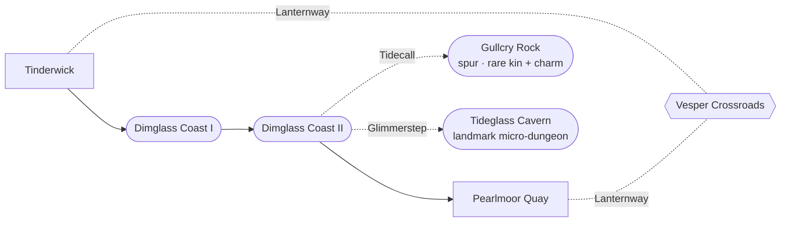

# PixelKin — World Atlas: *The Long Dusk*

> The map of **Vesperholm**: how the areas connect, how the central hub locks and
> opens, which **Lantern Gift** gates each path, and — for every area — its graphics
> direction, a ready-to-use **`generate-midi` music brief**, the kin found there, and
> its encounter terrain. Pairs with [`story-bible.md`](./story-bible.md) and
> [`README.md`](./README.md). All content original per [`../../VISION.md`](../../VISION.md).

Palette tokens used below are the brand anchors from `src/game/config.ts`:
`night #0b1026`, `deepBlue #13205a`, `diamond #9fe7ff`, `grass #7bdc6b`,
`fire #ff8a3d`, `water #4fb4ff`, `ink #1a1430`, `bone #f5f0e1`.

---

## 1. Shape of the region

Vesperholm is a **ring of valleys around a central darkened mountain** (the Umbral
Spire). Early game you travel the **outer rim** clockwise — valley to valley — because
the **Penumbra** (dark fog) seals every shortcut to the centre. As you relight
constellations, the fog recedes; when the **Skyweave Crown** completes, **four cardinal
roads** open inward at once and the **Vesper Crossroads** becomes the late-game fast-travel
hub. The slow loop collapses into a fast four-way wheel exactly when you've earned it.

Towns (rectangles) are joined by **themed routes** (stadium nodes) — the connective
grass/coast/marsh/forest/cave/mountain/frost/garden where most wild encounters and the
traversal gating live. Dotted edges need a Lantern Gift.

**Regions (for the 4-way hub model in `graph.ts`):**

| Region | Areas (towns **bold**, routes in italics) | Hub approach opens on |
|--------|-------|-----------------------|
| south | **Tinderwick**, *Dimglass Coast*, **Pearlmoor Quay** | `flag:crown_south` (Ember + Tide relit) |
| east | *Saltreach Fen*, **Lowleaf Hollow**, *Cinderhead Mine* | `flag:crown_east` (Verdant + Stone relit) |
| north | **Galehigh Terraces**, *Windward Stair*, **Pale Vault Glacier** | `flag:crown_north` (Storm + Frost relit) |
| west | *Hushfrost Pass*, **Sunken Solarium**, *Sunvault Climb*, **Nightreach Observatory** | `flag:crown_west` (Solar + Lunar relit) |
| outer | **Vesper Crossroads**, *Coldfog Marches*, *Lanternway* spokes | — (rim connectors) |
| central | *Penumbra Ring*, **Umbral Spire** | all four → `flag:hub_unlocked` |

> The four `crown_*` flags each set when that quadrant's two anchor-constellations are
> relit; all four set `flag:hub_unlocked`, which fully parts the Penumbra and opens the
> Crossroads → Spire roads. This is the progressive multi-directional unlock.

---

## 2. Area cards

Each card gives **Kind** (drives the `MapDefinition.kind` and music default), **Region**,
**Gate** (Lantern Gift / flag needed to fully explore it), **Graphics**, **Music** (a
direct `generate-midi` brief: *preset · mood · instrumentation · tempo & key feel · loop*),
**Kin** (archetypes → encounter tables), and **Terrain** (encounter-zone types).

---

### 1 · Tinderwick — *cosy coastal starting village (Lumenary 1: Ember)*
- **Kind:** town · **Region:** south · **Gate:** none (start)
- **Graphics:** `bone`-cream cottages with candle-`fire` windows against a `night` sky and
  `deepBlue` sea; everything lit by tiny flames; `ink` outlines; the blue-hour wash that
  sets the whole game's tone.
- **Music:** *preset `town` · gentle cosy lullaby, hopeful-melancholy · soft square-wave
  melody + slow "music-box" arpeggio + triangle bass · ~92 BPM, major with a wistful
  minor turn · seamless 16–24 bar loop.*
- **Kin:** *Wickmoth* (ember-winged moth, Ember); *Tallowpup* (waxy candle-tailed pup,
  Ember); *Glimflit* (firefly-sprite, Light).
- **Terrain:** none in town (battles are the Lumenary + scripted).

### 2 · Dimglass Coast — *tidal cliffside route*
- **Kind:** route · **Region:** south · **Gate:** none
- **Graphics:** `deepBlue` water with `diamond` foam highlights, dark `ink` rocks,
  lantern-buoys glowing cyan along the path; grass tufts catching the last light.
- **Music:** *preset `overworld` · airy, exploratory, the signature travel theme · wandering
  pulse-lead over lapping wave percussion + soft pad · ~120 BPM, bright major · loop.*
- **Kin:** *Brinelet* (round tide-pool kin, Tide); *Lumpin* (limpet with a glowing shell,
  Tide/Light); *Glimflit* (firefly-sprite, Light — drifts down the shore from Tinderwick,
  giving an Ember-starter a fair fight on a coast that otherwise favours Tide).
- **Terrain:** `tall_grass` (verges), `water` (shallows — needs **Tidecall** to enter).

### 3 · Pearlmoor Quay — *moonlit fishing port (Lumenary 2: Tide)*
- **Kind:** town · **Region:** south · **Gate:** **Tidecall** (islets & sea-shrine)
- **Graphics:** wet boardwalks reflecting moonlight, `water` glints, `bone` sails,
  a big cyan moon; lantern strings between masts.
- **Music:** *preset `town` · cosy, salt-aired, lilting · accordion-flavoured pulse waltz +
  bell-buoy chimes + gentle bass · ~100 BPM 3/4, warm major · loop.*
- **Kin:** *Mooncatch* (heron-silhouette night-fisher, Tide); *Glostern* (jellyfish-lantern,
  Tide/Light).
- **Terrain:** `water` (harbour & islet routes — **Tidecall**).

### 4 · Lowleaf Hollow — *bioluminescent fern forest (Lumenary 3: Verdant)*
- **Kind:** route/town · **Region:** east · **Gate:** **Glimmerstep** (hollow interiors)
- **Graphics:** `grass` foliage shot through with `diamond` glowmoss, deep `ink` shadows,
  a magical dim-green dark; dew catching cyan light.
- **Music:** *preset `cave`→atmospheric · mysterious, dewy, wonder · soft triangle bass +
  glassy bell arpeggios + breathy pad · ~88 BPM, lydian-tinged major · loop.*
- **Kin:** *Sporeling* (mushroom-cap sprite, Verdant); *Fennlight* (glowing fern-serpent,
  Verdant/Light); *Mossmole* (glow-snouted digging mole, Verdant).
- **Terrain:** `tall_grass`, `cave` (interior hollows — **Glimmerstep**).

### 5 · Cinderhead Mine — *abandoned gem mine, deep-earth gleam (Lumenary 4: Stone)*
- **Kind:** cave · **Region:** east · **Gate:** **Glimmerstep** (deep galleries)
- **Graphics:** `ink`-black tunnels lit by veins of `diamond` crystal and `fire` lamps;
  claustrophobic and sparkly; cart rails and timber.
- **Music:** *preset `cave` · sparse, echoing, faintly tense-but-warm · low pulse drones +
  distant pick-tap percussion + occasional crystal chime · ~80 BPM, minor · long loop.*
- **Kin:** *Gravelo* (crystal-backed tortoise, Stone); *Sparkrat* (static-furred rodent,
  Stone/Storm); *Glowpan* (lantern-faced cave imp, Light).
- **Terrain:** `cave` (**Glimmerstep**).

### 6 · Galehigh Terraces — *windy stepped cliff-farms (Lumenary 5: Storm)*
- **Kind:** route/town · **Region:** north · **Gate:** **Updraft Kite** (high terraces)
- **Graphics:** layered terraces, `fire` sunset bleeding into `night`-blue, kite
  silhouettes, fast-moving clouds, `diamond` updraft motes.
- **Music:** *preset `overworld` · bright, propulsive, soaring · staccato pulse lead +
  gusty noise-channel swells + driving bass · ~138 BPM, energetic major · loop.*
- **Kin:** *Kiteling* (paper-glider bird, Storm); *Thrumvane* (windmill-tailed kin, Storm);
  *Cirruff* (cloud-fluff pup, Storm/Light).
- **Terrain:** `tall_grass` (terraces). High ledges & gaps need **Updraft Kite**.

### 7 · Pale Vault Glacier — *aurora ice field (Lumenary 6: Frost)*
- **Kind:** route/town · **Region:** north · **Gate:** **Emberward** (coldfog pass)
- **Graphics:** cold `deepBlue` ice, `diamond` + faint `grass`-green aurora ribbons across
  the sky, `bone` snow, `ink` crevasses.
- **Music:** *preset `emotional`/ambient · glacial, shimmering, lonely-beautiful · slow bell
  pads + sparse chimes + a wide aurora "swoosh" swell · ~72 BPM, suspended major · loop.*
- **Kin:** *Frostkit* (frost-foxlet, Frost); *Auralisk* (aurora-ribbon serpent, Frost/Light);
  *Snowtoll* (bell-horned ice yak, Frost).
- **Terrain:** `tall_grass` (sheltered hollows), thin-ice paths (lore-gated by **Emberward**
  to reach the Lumenary).

### 8 · Sunken Solarium — *half-flooded ruined sun-garden (Lumenary 7: Solar)*
- **Kind:** route/ruin · **Region:** west · **Gate:** **Sunsketch** (sun-vine bridges)
- **Graphics:** submerged golden architecture, `fire` "stored daylight" glows under
  `water`, `bone` columns; warm light remembered in a drowned place.
- **Music:** *preset `emotional` · warm-melancholy, remembered summer · major-key pads + a
  wistful pulse melody + soft arpeggio · ~96 BPM, nostalgic major · loop.*
- **Kin:** *Sunsprout* (sun-flower bulb kin, Verdant/Solar); *Glentide* (warm-water koi,
  Tide/Solar); *Helibud* (rolling solar-seed, Solar).
- **Terrain:** `water` (flooded halls — **Tidecall**), sun-vine bridges (**Sunsketch**).

### 9 · Nightreach Observatory — *hilltop star-temple town (Lumenary 8: Lunar)*
- **Kind:** town · **Region:** west · **Gate:** **Emberward** (final coldfog approach)
- **Graphics:** a domed observatory in `bone` + `deepBlue`, telescope brass, the densest
  `diamond` starfield in the game; the most "sky-forward" town.
- **Music:** *preset `town`/reverent · vast, lonely, wondrous · slow arpeggiated pads + a
  lonely lead + faint ticking clockwork · ~84 BPM, contemplative minor→major · loop.*
- **Kin:** *Astrowl* (constellation-feathered owl, Lunar/Light); *Dreamoth* (huge
  dream-dusted moth, Lunar); *Tessel* (geometric star-fragment kin, Light).
- **Terrain:** none in town; the approach route carries `tall_grass`.

### 10 · Coldfog Marches — *the Hollowing-blighted wetland*
- **Kind:** route · **Region:** outer · **Gate:** **Emberward** (push through coldfog)
- **Graphics:** sickly desaturated blues, snuffed lanterns, `ink` mist swallowing colour —
  the one "drained" area; the visual cost of the Hollowing made plain.
- **Music:** *preset `boss`/uneasy ambient · hollow, faltering, near-silent · detuned pulses
  + a single guttering melody + long silences · ~70 BPM, unresolved minor · loop.*
- **Kin:** *Nullmoth* (grey moth with a dead lantern, Dark); *Wispwane* (guttering
  will-o'-wisp, Dark/Light); *Embergone* (ashen ex-Ember kin, Dark).
- **Terrain:** `tall_grass` (blighted), coldfog blockers (**Emberward**).

### 11 · Vesper Crossroads — *outer-ring hub waystation*
- **Kind:** hub · **Region:** outer · **Gate:** rim always; spokes to Spire need the
  `crown_*` / `flag:hub_unlocked` flags
- **Graphics:** a cosy lantern-lit inn at a many-way fork, warm windows, a great signpost;
  the "between" place travellers always return to.
- **Music:** *preset `town` · homey, friendly, loopable (heard often) · round pulse tune +
  soft bass + light bell · ~108 BPM, comfortable major · short tight loop.*
- **Kin:** *Lampling* (a sentient little vesperlamp kin, Light) — the cosy mascot, found
  only here.
- **Terrain:** none (safe hub).

### 12 · Penumbra Ring — *the dark-fog barrier around the centre*
- **Kind:** route (barrier) · **Region:** central · **Gate:** recedes by `crown_*` flags;
  final crossings need **Starreach**
- **Graphics:** a literal wall of swirling `ink`-and-shadow that recedes wedge by wedge as
  Gleams are earned; your lamp-glow is the only colour within.
- **Music:** *preset `boss`/tension · a low ambient drone that gains hopeful notes as it
  recedes · evolving pad + sparse heartbeat drum · ~60 BPM, dark→brightening · loop.*
- **Kin:** none reside here (kin refuse the dark).
- **Terrain:** none; pure traversal/gating space.

### 13 · Umbral Spire — *central locked mountain + the Ninth Lantern (climax)*
- **Kind:** cave/hub · **Region:** central · **Gate:** **Starreach** + `flag:hub_unlocked`
- **Graphics:** black basalt, the dead Lumenary, Còr's null-lanterns leaking anti-light;
  the final ascent under the completing **Skyweave Crown** overhead.
- **Music:** *preset `boss` · dread building to soaring; the boss theme resolves to major at
  the Keystar relight · layered lead + counter-lead + swelling pad + driving percussion ·
  ~150 BPM, minor→triumphant major · structured (intro → loop → resolve).*
- **Kin:** *Keylumen* (the radiant Keystar-kin, Light — the heart of the climax,
  signature/legendary); Còr's drained Hollowing kin (Dark).
- **Terrain:** scripted encounters only.

### 14 · Dawnstead — *the first-sunrise epilogue town*
- **Kind:** town · **Region:** south (near Tinderwick) · **Gate:** post-game
- **Graphics:** Tinderwick's silhouette flooded with `fire`-orange + `bone` **daylight** —
  the visual payoff of the whole journey; warm shadows, open sky.
- **Music:** *preset `victory`→`town` · a triumphant full reprise of the Tinderwick lullaby,
  now in major and fully instrumented · lead + counter-lead + harp arpeggio + warm bass ·
  ~100 BPM, radiant major · loop.*
- **Kin:** **day-forms** of early kin begin to appear (a fresh collecting hook), e.g. a
  sun-bright variant of *Wickmoth*.
- **Terrain:** `tall_grass` (now sunlit).

---

## 3. Routes & connective terrain

Like the cartridge-era games, **towns are joined by routes, and the routes carry the
adventure** — most wild encounters, the traversal gating, and the shifts in terrain happen
out on the road. Routes are first-class `MapDefinition`s (`kind: 'route' | 'water' |
'cave'`) and nodes in `VESPERHOLM_GRAPH` (`src/game/data/world/graph.ts`); a gift earned in
or near a town opens the route beyond it.

**Conventions** (all wired into the graph):

- **Segmented chains.** Each main inter-town route splits into **two named segments**
  (e.g. *Dimglass Coast I → II*), with the gift-gate on the segment *boundary* — the
  classic "Route 1 → Route 2" pacing, so crossing into the next stretch feels earned.
- **Spurs.** Each region has an optional **dead-end branch** ending in a reward, usually
  blocked by a *later* Gift so you come back for it — the "derelict works with a rare
  creature inside" pattern. (`AreaNode.optional` flags these.)
- **Signature landmarks.** A few bigger optional **micro-dungeons**, each with a unique
  kin reward.
- **Late shortcuts.** One-way links that **open from the far side** and permanently re-link
  a route to the hub — exploration that pays off as moves/story unlock.

### Segmented main routes (four also appear as area cards in §2)

| Route (segments) | Links | Terrain | Boundary gate |
|------------------|-------|---------|---------------|
| *Dimglass Coast I → II* † | Tinderwick ↔ Pearlmoor | cliff shore → tidal flats | open (Tidecall opens a shore spur) |
| **Saltreach Fen I → II** | Pearlmoor ↔ Lowleaf | open marsh → deep channels | **Tidecall** (I→II) |
| *Lowleaf Hollow → Glowmoss Deep* † | forest town → cave mouth | deep forest → glowing dark interior | **Glimmerstep** (into the deep) |
| *Cinderhead Mine → Cinderhead Deep* † | Lowleaf ↔ Galehigh | upper galleries → deep cave | **Glimmerstep** (deep) |
| **Windward Stair I → II** | Galehigh ↔ Pale Vault | lower switchbacks → high crags | **Updraft Kite** (I→II) |
| **Hushfrost Pass I → II** | Pale Vault ↔ Solarium | snow canyon → coldfog throat | **Emberward** (I→II) |
| **Sunvault Climb I → II** | Solarium ↔ Nightreach | overgrown terraces → sun-vine bridges | **Sunsketch** (I→II) |
| *Coldfog Marches I → II* † | Crossroads ↔ Nightreach (detour) | blighted marsh → deep coldfog | **Emberward** |
| **Lanternway** (spokes) | rim towns ↔ Crossroads | grass country lanes | open |

† doubles as an area card in §2 (its graphics/music/kin are there).

**Connective route detail** (graphics · music · kin) for the routes that aren't area cards:

| Route | Terrain (encounter) | Graphics | Music brief | Kin |
|-------|---------------------|----------|-------------|-----|
| **Saltreach Fen** | `tall_grass` + `water` | brackish reed shallows, `deepBlue` water, `grass` reeds, `bone` mist, `diamond` glints | *overworld · slow marsh wander · woodwind lead over lapping water + soft pad · ~104 BPM, gentle minor · loop* | reed-stalk heron (Tide/Flying), mudskip pup (Tide), marsh-lantern frog (Tide/Light) |
| **Windward Stair** | `tall_grass` (ledges) | switchback cliff stairs, `stone` greys, `fire` sunset into `night`, `diamond` updraft motes | *overworld · climbing, airy, building · high pulse lead + wind-swell noise + steady bass · ~132 BPM, bright major · loop* | crag-climber ram (Stone/Storm), slate-wing moth (Stone/Flying), gust-finch (Storm) |
| **Hushfrost Pass** | `tall_grass` (sheltered) | snowed canyon, `deepBlue` ice, `ink` coldfog walls, your lamp the only warmth | *emotional · cold, sparse, tense-but-tender · lone bell + low pad + faint heartbeat · ~68 BPM, suspended minor · loop* | ice-burrower (Frost), frost-wisp (Frost/Light), numbed ex-Ember kin near the fog (Frost/Dark) |
| **Sunvault Climb** | `tall_grass` | overgrown golden terraces, sun-vine bridges blooming open, `bone` steps, `fire`-warm glows | *overworld · warm, ascending, hopeful · major arpeggio lead + soft brass-ish pulse + harp · ~112 BPM, radiant major · loop* | sun-seedling (Verdant/Solar), vine-serpent (Verdant), glass-wing bee (Verdant/Light) |
| **Lanternway** (spokes) | `tall_grass` | hedged, lantern-lined country lanes, milestones, `grass`, `soil` path, `diamond` lamp dots | *overworld · the signature cosy travel loop, walking pace · plucky pulse lead + triangle bass + light bell · ~120 BPM, comfortable major · loop* | path-pup (Normal/Verdant), stile-cricket (Bug), lamp-moth (Light) |

### Optional content & rewards (spurs + landmarks)

| Place | Type | Off route | Gate | Reward |
|-------|------|-----------|------|--------|
| Gullcry Rock | spur | Dimglass II | Tidecall | rare sea-bird kin + a Tide charm |
| **Tideglass Cavern** | landmark | Dimglass II | Glimmerstep | micro-dungeon; a signature rare water kin |
| Sunkbell Shallows | spur | Saltreach II | Tidecall | rare Tide kin + item (flooded shrine) |
| Spore Grotto | spur | Glowmoss Deep | Glimmerstep | rare Bug/Verdant kin + item |
| Crystoll Vault | spur (late) | Cinderhead Deep | **Starreach** | rare Stone/Light kin (return trip) |
| **Wind-Eye** | landmark | Galehigh | Updraft Kite | sky-grotto micro-dungeon; a unique Storm kin |
| Thunderroost | spur | Windward II | Updraft Kite | rare Storm/Flying kin + item |
| Aurora Hollow | spur | Hushfrost II | Emberward | rare Frost/Light kin + item |
| Helia Vault | spur | Sunvault II | Sunsketch | rare Solar kin + item (sealed reliquary) |
| Drownlight Beacon | spur | Coldfog II | Emberward | rare Dark kin in a snuffed lighthouse |
| **Hollowfen Stillworks** | landmark | Coldfog II | Glimmerstep | a derelict Hollowing null-works hiding a powerful Storm/Dark "charged husk" kin — the "old power-plant" set-piece |
| **Starwell** | landmark (post-Crown) | Penumbra Ring | **Starreach** | a near-legendary kin |

> **How rewards are represented in data** (no new schema needed — see
> `src/game/data/world/types.ts`): a rare-kin reward is a low-weight `EncounterZone` entry
> (or a one-off static `EventTrigger` for a fixed catch); a hidden item is an
> `EventTrigger` (`kind: 'script'`) that sets a flag.

### Late shortcuts

- *Windward Stair II → Galehigh* — a ledge-drop back down, opened once you reach the crags
  (`flag:shortcut_windward`).
- *Cinderhead Deep → Vesper Crossroads* — a sealed mine door opened from the inside
  (`flag:shortcut_mine`), linking the eastern cave straight to the hub.

### Example: the south region in detail

Every region follows this shape — a segmented chain, a spur, a landmark, and a hub spoke:

**Terrain coverage across the world:** grass road (*Lanternway*), coast/shore (*Dimglass*),
marsh/shallow water (*Saltreach Fen*, *Coldfog Marches*), deep forest (*Lowleaf/Glowmoss*),
cave dungeon (*Cinderhead*), mountain/cliff (*Windward Stair*), frozen pass (*Hushfrost*),
overgrown ruin-garden (*Sunvault Climb*), plus optional sea-cave, sky-grotto, ice-hollow,
and a derelict works — every classic route flavour, each gating a different Lantern Gift so
the routes also teach traversal.

## 4. Encounter-table principle

Kin **thematically occupy areas**, so encounter tables are written *per area, per terrain*:
each `EncounterZone` (see [`README.md`](./README.md) and `src/game/data/world/types.ts`)
lists weighted kin with level ranges. Cohesion rules:

- A kin's **element matches its area's light** (Ember in Tinderwick, Tide on the coast,
  Verdant in the Hollow, …), so a region reads as one ecosystem.
- **Light-typed kin** thin out in drained/blighted areas (Coldfog Marches) and bloom in
  relit ones — the celestial calendar shifts tables as constellations relight.
- **Rarity:** common roamers fill `tall_grass`; rarer kin gate behind `water`/`cave`
  terrain that needs a Lantern Gift, rewarding traversal unlocks with new collectables.

## 5. Music production note

Every area card's **Music** line is written as a direct brief for the **`generate-midi`**
skill: it names a **preset**, then mood, instrumentation, tempo/key feel, and loop intent.
A first pass can generate one loop per area straight from these briefs; battle, Lumenary
(arena), and victory stings are shared cross-region cues layered on top. Keep all tracks in
the GBC→GBA voice budget the skill enforces, and write mp3 loops into
`public/assets/audio/music/` keyed to each `MapDefinition.music`.

> **Want options?** Each area card above gives *one* music brief. For **2–3
> auditionable music options per area and route** — each a ready `generate-midi`
> brief, grounded in the place's mood/element and the cartridge-era inspiration —
> see **[`music-direction.md`](./music-direction.md)**. The cohesion rules behind
> all of them (the recurring *Vesper motif*, per-element sonic signatures, the
> voice/era policy, the dusk→dawn key arc) live in the skill's
> [`pixelkin-soundtrack.md`](../../.claude/skills/generate-midi/references/pixelkin-soundtrack.md).
